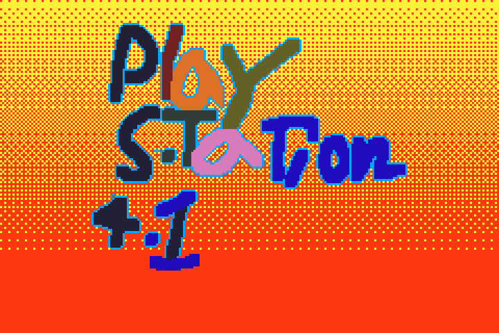

# Art Auction Project 2026 - 3rd Grade

## Project: "Pixel Classroom"

This is an art-meets-computer project.
It is about pixels and representation, referencing video games that have a 'pixel-art' aesthetic, like Minecraft and how that can apply to making self-portraits.
Students will learn about pixels, pixel-art, and game design.

### Outline:
- Discuss, "What is a Pixel?"
- Pixel: short for 'picture element' -- each has a Red, Green, Blue value -- the little dots that make up a screen!
- When put all those dots together, you get an image.
- Has anyone watched a video, or played minecraft or a video game before? Millions of pixels!
- Demo project and examples. 1 pixel, spritesheet (collection of pixel images collated on one larger image), etc.
- Activity: Students make a hand-colored 16x16 "pixel" self-portrait and a hand-colored "pixel" classroom object.
- Parent helpers scan in student artwork with their phones (still being worked on): https://ngolebiewski.github.io/pixel-camera/
- Discuss how to make a game using the students' artwork. i.e. you are in a classroom and have lost your ruler, search around until you find it.

### Art Auction project: A Spritesheet photo print and a classroom created stand-alone video game.
(2 parts)
1. 16x20 (or so) photo print of the 'spritesheet' collecting the students' art
2. A stand alone mini video game, on a tiny touchscreen attached to a Raspberry Pi*, using the art the students made. Runs a demo until someone starts playing.
*Raspberry Pi's are mini single-board-computers that are often used in robotics projects.

### Supplies/Budget:
- Paper printed with four 16x16 grids (no cost, from PTA office)
- Markers (already have?)
- Parent to donate a usb cable and plug
- Raspberry Pi Zero 2W: $25
- LCD Screen: $25
- Controller and Misc: $15
- Color photographic Print: $16.80 + $5 Shipping
Total cost $80-$90

# The Game

Image: Student Title Art

### Technology

Ebitengine: Go Game Engine
Aseprite: Pixel Art Editor
Tiled: Tilemaps

Sounds made on:
Beepbox sequencer: [____](https://www.beepbox.co/#9n31s7k4l00e03t2ma7g0fj07r1i0o432T0v1u13f10o5q00d03w5h1E0T0v1u11f0qg01d04w1h0E0T7v1u20f51562jb0s22nb2l3q0x20p41402d08H_SRJ5JIBxAAAAkh8IcE3c01c16c16T2v1u15f10w4qw02d03w0E0b4xc00000000h4g000000014h000000004h400000000p21JFEYpkCLV8YChOif9AqldvRMANqq_BvtknTSkkQvy1wbqWXGWWqF2BjkZue8Mnd7O448WGEOVeX8WGEOV06yeGG8M01jhD3bwyeAzEcKAzEE00)
Sound effects ZZFX: https://killedbyapixel.github.io/ZzFX/
- Song Example: Interlude riff:  https://is.gd/m1pcxZ

# Run Locally
1. Clone github Repo
2. Install Go
3. `go mod tidy`

## Build binary on your computer
- `go build -o ~/Desktop/playstation41_dev`

## Build WASM for web version
- `cp "$(go env GOROOT)/lib/wasm/wasm_exec.js" .`
- `GOOS=js GOARCH=wasm go build -o play_station_41.wasm .`
- View in 'Live Server'

## Get on your Raspberry Pi 3 A+
wget https://github.com/nickgolebiewski/playstation41/releases/latest/download/playstation41_pi
chmod +x playstation41_pi
DISPLAY=:0 ./playstation41_pi

`wget -O playstation41_pi https://github.com/nickgolebiewski/playstation41/releases/latest/download/playstation41_pi && chmod +x playstation41_pi && DISPLAY=:0 ./playstation41_pi`

## Actually run the MacOS Silicon Binary
Open your terminal and run these two commands on the file you just downloaded:
Bash

1. Give the file permission to run as a program
`chmod +x ~/Downloads/playstation41_macos`

2. Strip the 'Malware' warning flag
`xattr -d com.apple.quarantine ~/Downloads/playstation41_macos`

3. Now, instead of double-clicking it in Finder (which might still default to TextEdit), run it directly from the terminal:
`./~/Downloads/playstation41_macos`

